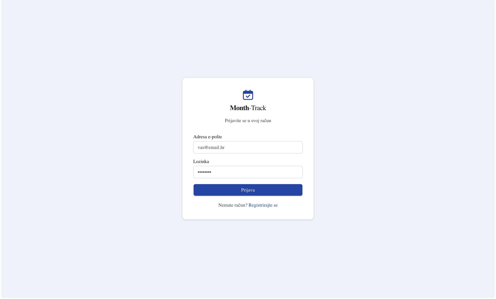
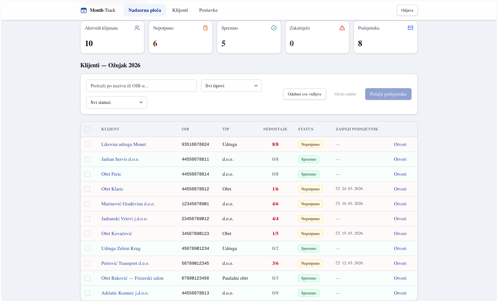
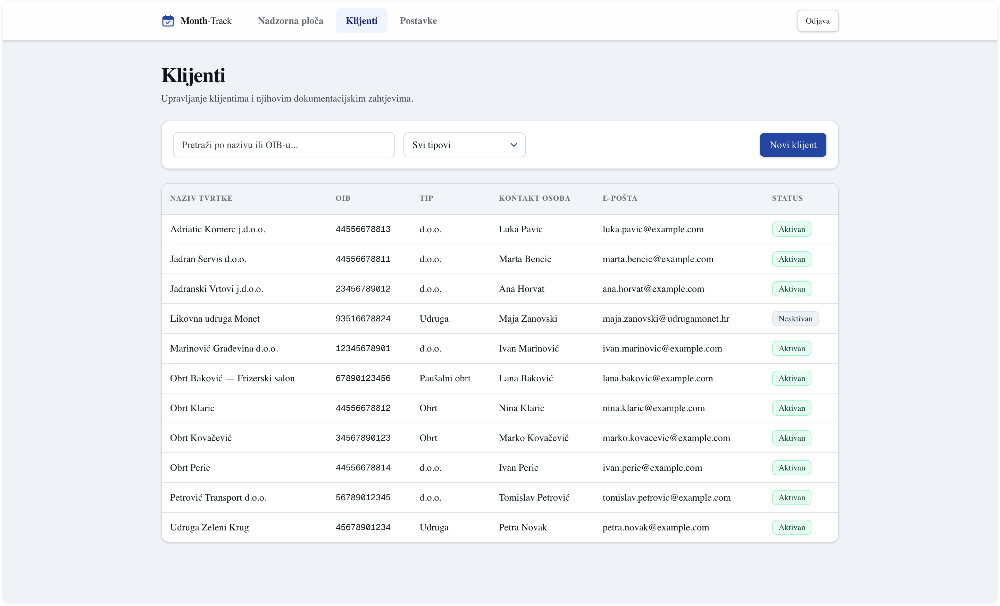
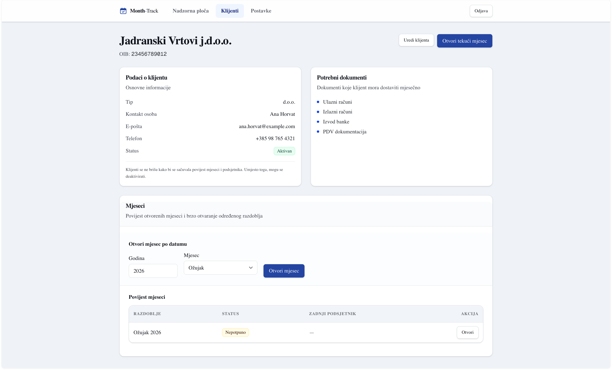
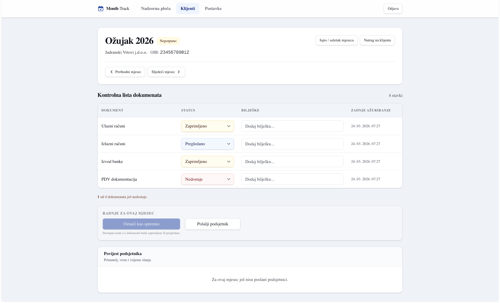
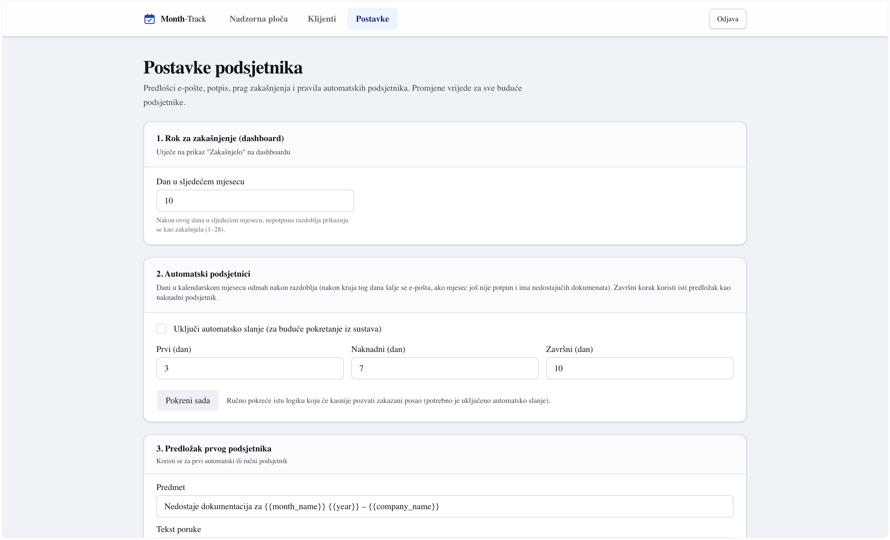
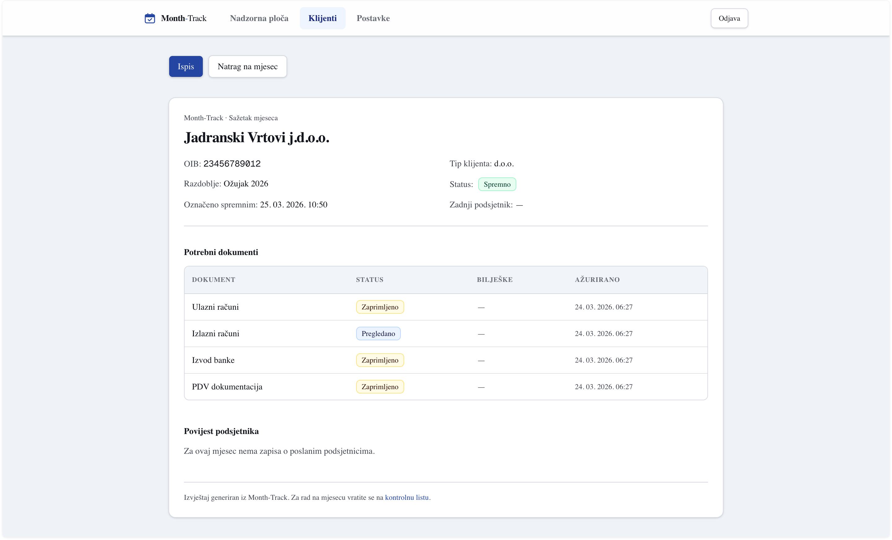

# Month-Track

Workflow app for Croatian accounting firms to track missing monthly client documents, reminders, and month-end readiness.

## Overview

Month-Track helps accounting offices see which monthly documents each client still owes, coordinate follow-up before deadlines, and keep a clear record of month-by-month status. It is built for **accountants and office staff** who manage many clients and recurring monthly obligations—not for end clients directly.

The product closes the operational gap between knowing what should arrive each month and knowing exactly what is still missing, for which client, and whether follow-up has already happened.

## Core features

- **Authentication and protected routes** — Email/password sign-in via Supabase Auth; application routes are protected; session handling with middleware.
- **Client management** — Create, edit, and deactivate clients (history is preserved); company details, OIB, contacts, and activity state.
- **Croatia-specific client presets** — Client types aligned with common Croatian practice (e.g. paušalni obrt, obrt, d.o.o., udruga) with sensible default document expectations.
- **Lazy month creation** — A client-month is created when opened, not pre-generated for all periods.
- **Monthly document checklist** — Per month, per client: document rows with status (e.g. missing, received, reviewed) and notes.
- **Month ready / incomplete workflow** — Incomplete months with missing items stay visible as such; when everything is in order, the month can be marked ready.
- **Dashboard overview** — Current-period view across clients: filters, search, status and overdue cues, row-level context for missing documents and last reminder.
- **Single and bulk reminders** — Send reminder emails from a client-month or select multiple rows on the dashboard; configurable templates; sends are logged and last-reminder timestamps updated.
- **Automatic reminder scheduling** — Configurable day-offset rules for first, follow-up, and final automated reminders for incomplete months with missing documents (logic is server-side; can be triggered manually or by a job later).
- **Month history and navigation** — Browse a client’s months; open by period; previous/next navigation between adjacent months.
- **Configurable overdue threshold** — User setting (day of the following month, 1–28) for when a client-month is treated as overdue on the dashboard (default aligned with common office practice).
- **Printable monthly summary** — Printable view of the monthly situation for review or filing.
- **Croatian auth email templates** — Supabase auth flows use Croatian-oriented copy for confirmation, magic link, and recovery where applicable.

## Tech stack

| Layer | Technology |
| --- | --- |
| Framework | Next.js (App Router) |
| Language | TypeScript |
| Styling | Tailwind CSS |
| UI | shadcn/ui (Radix primitives) |
| Auth & database | Supabase (Auth, PostgreSQL, RLS) |
| Transactional email | Resend |
| Hosting | Railway |

## Workflow

1. An **accountant creates a client** and selects which document types that client must submit each month.
2. The user **opens a month** for that client; the period and checklist rows are created as needed.
3. **Document statuses** are updated as mail arrives (missing → received → reviewed), with optional notes.
4. **Reminders** are sent from the month screen or in bulk from the dashboard when documents are still missing; templates and firm details are configured under settings.
5. The **dashboard** is used to monitor the current period across all clients, filter, and act on rows that need attention.
6. When everything required is accounted for, the user **marks the month as ready**.
7. **Summary** supports a printable monthly overview; **settings** cover reminders, overdue threshold, and automatic reminder rules.

## Deployment

The app runs on **Railway**. **Supabase** provides authentication and the PostgreSQL database (with row-level security). **Resend** delivers application emails including reminders.

Sending reminders to **arbitrary client addresses in production** requires a **verified sender or domain** in Resend (and appropriate DNS). Until that is configured, delivery may be limited to test/sandbox behaviour depending on your Resend project settings.

## Local development

```bash
npm install
```

Create `.env.local` in the project root:

```env
NEXT_PUBLIC_SUPABASE_URL=
NEXT_PUBLIC_SUPABASE_ANON_KEY=
RESEND_API_KEY=
```

Start the development server:

```bash
npm run dev
```

Open [http://localhost:3000](http://localhost:3000).

## Current status

**Month-Track v2.2** — Deployed and working end-to-end for the accountant workflow described above. **Repository is private.**

## Roadmap

- Incorporate feedback from practicing accountants.
- Stronger workflow refinement (status rules, bulk operations, reporting) based on real use.
- Optional future **client portal** (uploads, self-service) if product direction supports it.
- Production **sender/domain** setup on Resend for unrestricted reminder delivery.

## Notes

- **Croatia-focused** in this version: UI copy, document concepts, and defaults reflect that context.
- **Accountant-side product**; clients do not log into Month-Track in the current version.
- **No OCR**, **no XML parsing**, and **no third-party accounting system integrations** in scope today.

## Screenshots

Static previews (paths relative to repository root).

**Prijava** — ulaz u aplikaciju i autentifikacija



**Nadzorna ploča** — pregled statusa po klijentima i mjesecima



**Klijenti** — popis klijenata i filtri



**Detalji klijenta** — podaci o klijentu i pristup mjesecima



**Kontrolna lista mjeseca** — praćenje dokumenata, statusa i radnji



**Postavke podsjetnika** — predlošci i pravila podsjetnika



**Sažetak** — pregled mjeseca za ispis i internu provjeru



## Copyright

Copyright © 2026 Joso Skarica. All rights reserved.

This repository is publicly visible for portfolio and evaluation purposes only.
No license is granted to use, copy, modify, distribute, or commercially exploit the source code in this repository.
